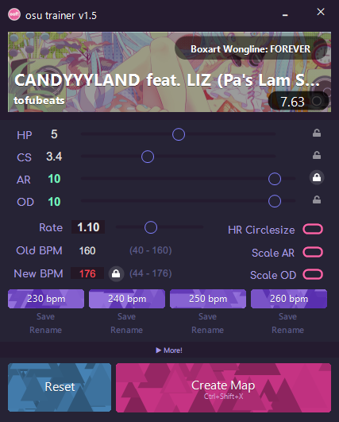

# osu-trainer
The main feature is the bpm controls, but you can also change other stuff too.

### Additional Notes
+ Search "osutrainer" in osu! to find all your generated maps
+ If you use this application a lot, you can end up using a lot of disk space. (333 mp3s * 3MB/mp3 = 1GB). To free up this space, delete the generated maps in osu, then click the Clean Up button in osu trainer.
+ The lock buttons are intended to be used alongside the create map shortcut in order to easily create multiple similar maps. Eg. Lock bpm to 220 bpm, then in osu! press Ctrl+Shift+X to quickly create a 220 bpm version of the beatmap without ever alt-tabbing.

Special thanks to [Craftplacer](https://github.com/Craftplacer) for making the UI really nice and pretty

## Licenses
This project uses the following projects:
- [Font Awesome](https://fontawesome.com/), [licensed under the CC BY 4.0 License](https://creativecommons.org/licenses/by/4.0/)
- [Comfortaa](https://fonts.google.com/specimen/Comfortaa), [licensed under the Open Font License](https://scripts.sil.org/cms/scripts/page.php?site_id=nrsi&id=OFL)
- [osu-resources](https://github.com/ppy/osu-resources), [licensed under the CC BY 4.0 License](https://creativecommons.org/licenses/by-nc/4.0/legalcode)
- [oppai-ng](https://github.com/Francesco149/oppai-ng), [licensed under GPL-3.0](https://github.com/Francesco149/oppai/blob/master/LICENSE)
- [ProcessMemoryDataFinder](https://github.com/Piotrekol/ProcessMemoryDataFinder), [licensed under GPL-3.0](https://github.com/Piotrekol/ProcessMemoryDataFinder/blob/master/LICENSE)
- [LAME](https://lame.sourceforge.io/)
